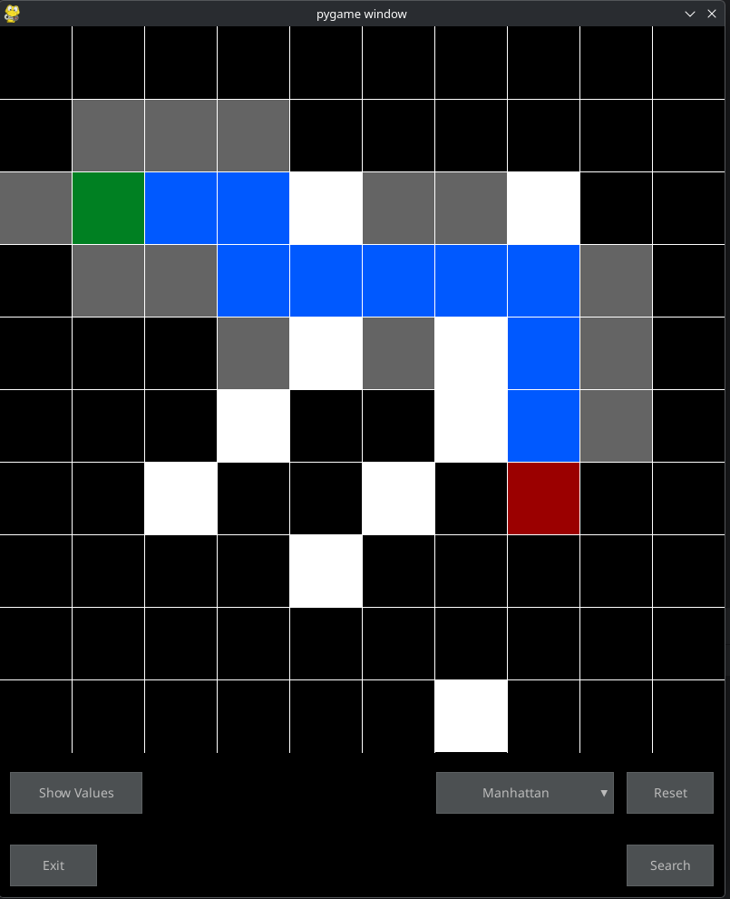

# Pathfinder

**Pathfinder** is an interactive A* (A-Star) pathfinding algorithm visualization tool built with Python and Pygame. It demonstrates how the A* algorithm intelligently navigates through obstacles to find the optimal shortest path between two points on a grid, using configurable heuristic functions.



## Features
- **A* Algorithm Implementation**: Visual demonstration of the A* pathfinding algorithm in action
- **Multiple Heuristics**: Choose between Manhattan, Euclidean, and Diagonal distance heuristics
- **Interactive Grid**: Click to place start/end points and draw obstacles
- **Real-time Visualization**: Watch the algorithm explore nodes (open/closed lists) and calculate the optimal path
- **Educational Tool**: Perfect for learning and understanding how A* pathfinding works with f, g, and h values

## Quick Start
```bash
python3.10 -m venv .venv
source .venv/bin/activate
pip install -r requirements.txt
python main.py
```

## How it works

---
**Screenshot Tip**: Capture a moment during pathfinding showing:
- The green start node and red target node
- White barrier walls creating obstacles
- Yellow/green nodes showing the open list (being explored)
- Gray nodes showing the closed list (already evaluated)
- Blue path showing the final optimal route
